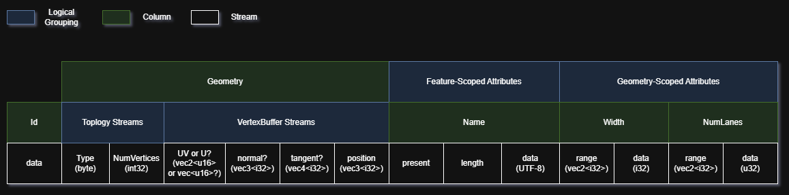
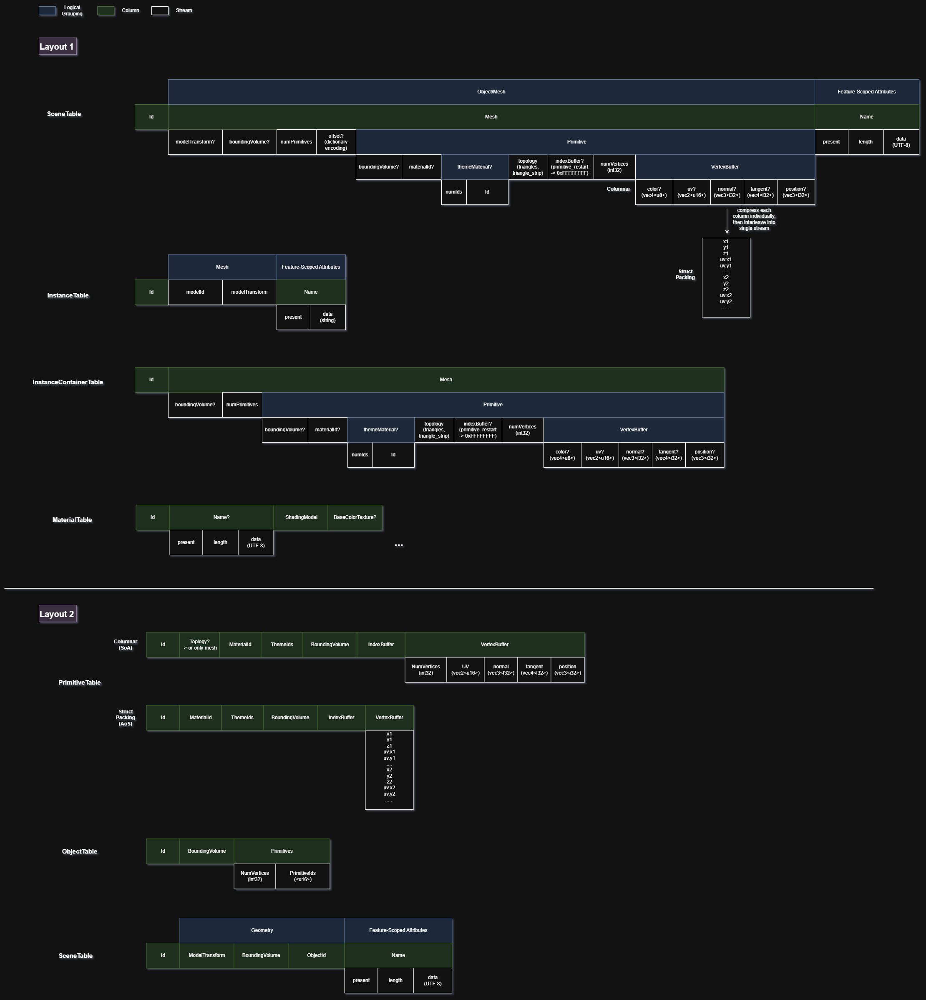

# MapLibre Tile (MLT) 3D Extension

This design document builds on the [initial proposal](https://github.com/alasram/mlt_3d_tile_schema) for MLT 3D by [alasram](https://github.com/alasram), extending it with an efficient encoding strategy and additional design considerations.

## Context and scope

The MLT 3D extension aims to provide a simplified 3D tile format optimized for the cartographic use case—enabling low-latency rendering that preserves the familiar "slippy map" experience, even on mobile devices and bandwidth-constrained networks. The target is a simplified 3D representation of the real-world environment, specifically navigation views in the style of [Google Maps Immersive Navigation](https://blog.google/products-and-platforms/products/maps/ask-maps-immersive-navigation/), rather than LiDAR point clouds or photorealistic 3D with high-resolution textures such as Google's [Photorealistic 3D Tiles](https://developers.google.com/maps/documentation/tile/3d-tiles) (where Gaussian splatting is a promising direction). That photorealistic segment is already well served by 3D Tiles—a powerful format and the right choice massive 3D geodata content such as photogrammetry, BIM/CAD and point clouds. However, for navigation-oriented 3D mapping, 3D Tiles introduces unnecessary overhead through concepts designed for the general case: the genericity of glTF, hierarchical levels of detail with geometric error, different refinement strategies, adaptive spatial data structures. The goal of MLT 3D is therefore to provide a streamlined alternative that targets the cartographic use case directly, building on MLT's core concepts (columnar layout, lightweight encoding schemes, ...).

## Goals and non-goals

### Goals

#### Functional requirements
The format should support the encoding of 2.5D and 3D objects, including:
- **Buildings and structures (e.g., bridges)** (LOD1/LOD2). High-resolution models (LOD3+) are reserved for
  prominent landmarks that serve as orientation aids during navigation, not for widespread use.
- **Instanced objects** such as traffic lights, stop signs, and trees.
- **Lane geometries** including lane transitions and pedestrian crossings.
- **2.5D terrain**

#### Non-functional requirements
- Optimized for minimal tile size to perform well in bandwidth-constrained and resource-limited environments.
- Preserve the familiar "slippy map" user experience by enabling low-latency rendering.

### Non-goals

Photorealistic simulation of the environment. This includes concepts for efficiently rendering complex, highly detailed 3D models with high-resolution textures.

## Layout and Encoding

### Design idea

Favor parametric representations over pre-tessellated meshes wherever possible. Compute or mesh shaders extrude geometry on the client, avoiding the cost of storing larger pre-computed meshes (a classic space–time tradeoff).

### FeatureTable

Stores parametric and procedural 2.5D/3D objects as compact attribute descriptions rather than pre-tessellated meshes. This is the preferred encoding strategy over GPUTables wherever applicable, as it minimizes tile size—and therefore latency—by
deferring mesh generation to the client.

**Core paradigm:** compact representation → GPU expansion → render.

- **Primary use case:** 2.5D objects such as LOD1 extruded buildings and 3D roads, represented as parametric data.
- **Modeling approach:** procedural/parametric geometry where the mesh is reconstructed on the GPU from compact
  attribute descriptions, shifting away from the glTF model of storing fully pre-tessellated geometry.
- **Memory layout:** struct packing for vertex buffers (SoA)—compress each column individually,
  then interleave into a single stream (similar to the approach described in the [Lance format](https://arxiv.org/abs/2504.15247)).

**Example 2.5D/3D object types:**

- **Buildings (LOD1):** Footprint polygon extruded to a given height on the GPU.
> **Open question:** Should LOD2 buildings (e.g., distinct roof shapes) also be encoded parametrically (e.g. as a footprint plus a 
> roof-type enum and ridge height) or is the added complexity not worth the size savings over pre-tessellated geometry?
- **3D roads:** Road geometry is modeled along a reference line, following a similar concept to [OpenDRIVE](https://www.asam.net/standards/detail/opendrive/). Appearance is not defined in the FeatureTable but controlled through a separate data-driven style document.

### GPUTables

Stores explicit 3D mesh geometry in a GPU-ready layout across various tables, used when parametric representation via FeatureTables is not feasible.

- **SceneTable:** Contains 3D objects as explicit mesh geometries in a flat scene (no hierarchy). Each mesh may contain one or more primitives. Redundancy across meshes and primitives is reduced through dictionary encoding. This serves as the 3D counterpart to a FeatureTable.
- **InstanceTable:** References instanced 3D objects (e.g., trees, traffic lights) by pointing to shared models defined in the InstanceContainerTable.
- **InstanceContainerTable:** Stores all shared 3D instance models for the dataset. Models are also individually requestable.
- **MaterialTable:** Stores material definitions referenced by primitives.
- **Texture Atlas:** External container file storing shared texture data.

The following diagram outlines two possible layouts at a high level:

## Open questions

- Which refinement strategy should be used for 3D objects such as buildings (replacement only, or also additive)?
- Which data types should be used, and which graphics API constraints apply? For example, `u16` is not supported in WebGPU.
- Is a data structure needed at higher zoom levels (e.g., z15+) to signal which tiles contain only 3D model data in dense areas and no vector data, similar to the availability structure in 3D Tiles?
- Can point-based positioning for terrain-clamped objects (no scaling, no rotation) be combined with transform-matrix-based positioning for non-clamped objects to reduce storage size?
- MLT currently supports only linear interpolation between vertices, not splines or Bézier curves commonly used in road modeling. Should these geometry types be added?
- Where should test data for 3D roads and LOD2+ buildings be sourced?

## Comparison to 3D Tiles

MLT 3D is intentionally narrower in scope than 3D Tiles/glTF. Some key differences:

- **Less generic than glTF:** No JSON-based accessor/bufferView indirection; geometry layout is defined by the table schema directly.
- **Fixed quadtree tiling scheme:** MLT 3D relies on the standard XYZ/TMS quadtree pyramid, which enables random access by tile coordinate (comparable to implicit tiling in 3D Tiles), but foregoes support for adaptive and 3D spatial index structures.
- **Zoom-level LOD instead of geometric error:** LOD transitions are driven by discrete zoom levels with simple replacement refinement. There is no per-tile geometric error metric and no support for additive refinement.
- **No point cloud support:** Focused on cartographic, not large-scale survey data.
- **Columnar storage layout:** MLT 3D is based on a columnar storage layout with lightweight encoding schemes.

